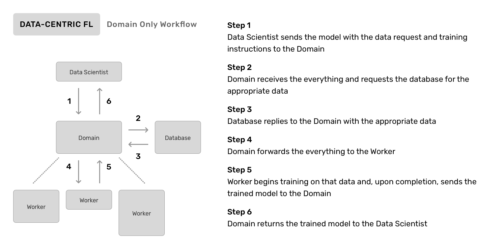
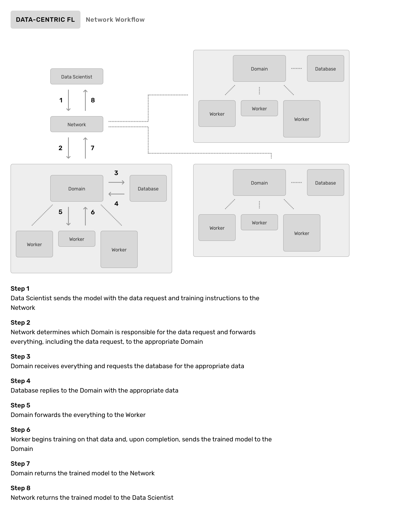

# Morigin Network - PyGrid Integrated with Oasis Labs Parcel


## Introduction

This project is a modified version of PyGrid, the federated learning orchestration backend. Modifications were made such that it will:

- works with weight differences reported from clients and stored in Parcel; and
- launch an averaging Parcel Job to compute averaging in a secure way, protecting the privacy of users.

Throughout the training, clients will keep reporting metadata to PyGrid as usual. However, the actual weight differences will be uploaded to Parcel directly from client devices.

## List of Modifications

1. `Dockerfile`: the Docker file that is used to build the image for weight averaging for intermediate cycles
2. `Dockerfile_crypten`: the Docker file that is used to build the image for final cycle weight averaging and outputs two encrypted model weight files for SMPC inferencing
3. `apps/domain/src/main/avg.py`: the averaging work used in the Docker image 1 (copy this to the same directory as the dockerfile if you build the docker image yourselves)
4. `apps/domain/src/main/avgfinal.py`: the averaging work used in the Docker image 2 (copy this to the same directory as the dockerfile if you build the docker image yourselves)
5. `apps/domain/src/main/events/model_centric/fl_events.py`:  In the `report` function, the code for doing b64decode is removed since the input to the `diff` parameter will be a string-based document ID.  In the `host_federated_learning` function, code for retrieving the inference model is added.  
6. `apps/domain/src/main/core/model_centric/controller/fl_controller.py`: Saving the inference model to the `/pygrid/models` directory (please create this directory in advance)
7. `apps/domain/src/main/core/model_centric/cycles/worker_cycle.py`: in the database schema, changed diff from binary to string
8. `apps/domain/src/main/core/model_centric/cycles/cycle_manager.py`: in the `_average_plan_diffs` function, removed code for running averaging locally, and call the `Runaveraging` function in the next step instead
9. `apps/domain/src/main/core/model_centric/cycles/send_avgrequest.py` : submit the averaging Parcel Job, download the Job output, which is the improved model, and start the next training cycle. In case it is the final cycle, the improved model will not be downloaded, but the encrypted model weights will be output to the SMPC workers directly.

## Setup

Please refer to the PyGrid instructions for environment setup before following the steps for Parcel specific setup:

1. Install the following pip packages: `python-jose`, `jwcrypto` for Parcel API authentication
2. Build and push the Docker image to Docker Hub using `./Dockerfile`
3. Set the values of `PARCEL_CLIENT_ID`, `PARCEL_APP_ID`, `PARCEL_JWK`, `DOCKER_IMG_TAG`, `DOCKER_IMG_TAG2`, `SMPC_WORKER1`, `SMPC_WORKER2` in `apps/domain/src/main/core/model_centric/cycles/send_avgrequest.py`
4. At `./apps/domain`, run `poetry run python ./src/__main__.py --name bob --port 7001 --start_local_db`


[](https://github.com/OpenMined/PyGrid/actions?query=workflow%3A%22Run+tests%22)

### Deprecation note
For convenience reasons, this repository has been moved into PySyft: 
```
https://github.com/OpenMined/PySyft/tree/dev/packages/grid
```

New developments and issues will be managed in this monorepo structure.

## PyGrid
PyGrid is a peer-to-peer network of data owners and data scientists who can collectively train AI models using [PySyft](https://github.com/OpenMined/PySyft/). PyGrid is also the central server for conducting both model-centric and data-centric federated learning.

You may control PyGrid via our user-interface, [PyGrid Admin](https://github.com/OpenMined/pygrid-admin).

## Architecture

PyGrid platform is composed by three different components.

- **Network** - A Flask-based application used to manage, monitor, control, and route instructions to various PyGrid Domains.
- **Domain** - A Flask-based application used to store private data and models for federated learning, as well as to issue instructions to various PyGrid Workers.
- **Worker** - An emphemeral instance, managed by a PyGrid Domain, that is used to compute data.

## Use Cases

### Federated Learning

Simply put, federated learning is machine learning where the data and the model are initially located in two different locations. The model must travel to the data in order for training to take place in a privacy-preserving manner. Depending on what you're looking to accomplish, there are two types of federated learning that you can perform with the help of PyGrid.

#### Model-centric FL

Model-centric FL is when the model is hosted in PyGrid. This is really useful when you have data located at an "edge device" like a person's mobile phone or web browser. Since the data is private, we should respect that and leave it on the device. The following workflow will take place:

1. The device will request to train a model
2. The model and a training plan may be sent to that device
3. The training will take place with private data on the device itself
4. Once training is completed, a "diff" is generated between the new and the original state of the model
5. The diff is reported back to PyGrid and it's averaged into the model

This takes place potentially with hundreds, or thousands of devices simultaneously. **For model-centric federated learning, you only need to run a Domain. Networks and Workers are irrelevant for this specific use-case.**

_Note:_ For posterity sake, we previously used to refer to this process as "static federated learning".


#### Data-centric FL

Data-centric FL is the same problem as model-centric FL, but from the opposite perspective. The most likely scenario for data-centric FL is where a person or organization has data they want to protect in PyGrid (instead of hosting the model, they host data). This would allow a data scientist who is not the data owner, to make requests for training or inference against that data. The following workflow will take place:

1. A data scientist searches for data they would like to train on (they can search either an individual Domain, or a Network of Domains)
2. Once the data has been found, they may write a training plan and optionally pre-train a model
3. The training plan and model are sent to the PyGrid Domain in the form of a job request
4. The PyGrid Domain will gather the appropriate data from its database and send the data, the model, and the training plan to a Worker for processing
5. The Worker performs the plan on the model using the data
6. The result is returned to the Domain
7. The result is returned to the data scientist

For the last step, we're working on adding the capability for privacy budget tracking to be applied that will allow a data owner to "sign off" on whether or not a trained model should be released.

_Note:_ For posterity sake, we previously used to refer to this process as "dynamic federated learning".

**Domain-only data-centric FL**

Technically speaking, it isn't required to run a Network when performing data-centric federated learning. Alternatively, as a data owner, you may opt to only run a Domain, but participate in a Network hosted by someone else. The Network host will not have access to your data.



**Network-based data-centric FL**

Many times you will wat to use a Network to allow multiple Domains to be connected together. As a data owner, it's not strictly necessary to own and operate mulitple Domains. PyGrid doesn't prescribe one way to organize Domains and Networks, but we expose these applications to allow you and various related stakeholders to make the correct decision about your infrastructure needs.



## Local Setup

Currently, we suggest two ways to run PyGrid locally: Docker and manually running from source. With Docker, we can organize all the services we'd like to use and then boot them all in one command. With manually running from source, we have to run them as separate tasks.

### Docker

To install Docker, just follow the [docker documentation](https://docs.docker.com/install/).

#### 1. Setting the your hostfile

Before start the grid platform locally using Docker, we need to set up the domain names used by the bridge network. In order to use these Domains from outside of the containers context, you should add the following domain names on your `/etc/hosts`

```
127.0.0.1 network
127.0.0.1 alice
127.0.0.1 bob
127.0.0.1 charlie
127.0.0.1 dan
```

Note that you're not restricted to running 4 nodes and a network. You could instead run just a single node if you'd like - this is often all you need for model-centric federated learning. For the sake of our example, we'll use the network running 4 nodes underneath but you're welcome to modify it to your needs.

#### 2. Run Docker Images

The latest PyGrid Network and Node images are also available on the Docker Hub.

- [PyGrid Domain - `openmined/grid-domain`](https://hub.docker.com/repository/docker/openmined/grid-domain)
- [PyGrid Worker - `openmined/grid-worker`](https://hub.docker.com/repository/docker/openmined/grid-worker)
- [PyGrid Network - `openmined/grid-network`](https://hub.docker.com/repository/docker/openmined/grid-network)


#### 3. _Optional_ - Build your own images

If you want to build your own custom images, you may do so using the following command for the Node:

```
docker build ./apps/domain --file ./apps/domain/Dockerfile --tag openmined/grid-domain:mybuildname
```

Or for the Worker:

```
docker build ./apps/worker --file ./apps/worker/Dockerfile --tag openmined/grid-worker:mybuildname
```

Or for the Network:

```
docker build ./apps/network --file ./apps/network/Dockerfile --tag openmined/grid-network:mybuildname
```

### Manual Start

#### Running a Node

> ##### Installation
>
> First install [`poetry`](https://python-poetry.org/docs/) and run `poetry install` in `apps/node`

To start the PyGrid Node manually, run:

```
cd apps/node
./run.sh --id bob --port 5000 --start_local_db
```

You can pass the arguments or use environment variables to set the network configs.

**Arguments**

- `-h, --help` - Shows the help message and exit
- `-p [PORT], --port [PORT]` - Port to run server on (default: 5000)
- `--host [HOST]` - The Node host
- `--num_replicas [NUM]` - The number of replicas to provide fault tolerance to model hosting
- `--id [ID]` - The ID of the Node
- `--start_local_db` - If this flag is used a SQLAlchemy DB URI is generated to use a local db

**Environment Variables**

- `GRID_NODE_PORT` - Port to run server on
- `GRID_NODE_HOST` - The Node host
- `NUM_REPLICAS` - Number of replicas to provide fault tolerance to model hosting
- `DATABASE_URL` - The Node database URL
- `SECRET_KEY` - The secret key

#### Running a Network

To start the PyGrid Network manually, run:

```
cd apps/network
./run.sh --port 7000 --start_local_db
```

You can pass the arguments or use environment variables to set the network configs.

**Arguments**

- `-h, --help` - Shows the help message and exit
- `-p [PORT], --port [PORT]` - Port to run server on (default: 7000)
- `--host [HOST]` - The Network host
- `--start_local_db` - If this flag is used a SQLAlchemy DB URI is generated to use a local db

**Environment Variables**

- `GRID_NETWORK_PORT` - Port to run server on
- `GRID_NETWORK_HOST` - The Network host
- `DATABASE_URL` - The Network database URL
- `SECRET_KEY` - The secret key

## Deployment & CLI

[Please check the instruction for deployment and CLI here.](deployment.md)


## Contributing

If you're interested in contributing, check out our [Contributor Guidelines](CONTRIBUTING.md).

## Support

For support in using this library, please join the **#support** Slack channel. [Click here to join our Slack community!](https://slack.openmined.org)

## License

[Apache License 2.0](LICENSE)
